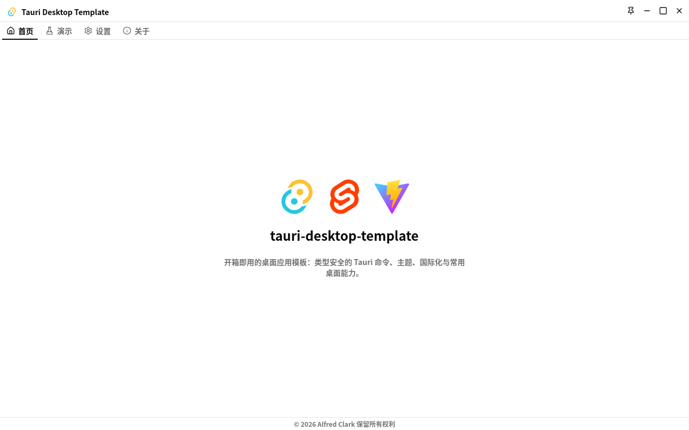
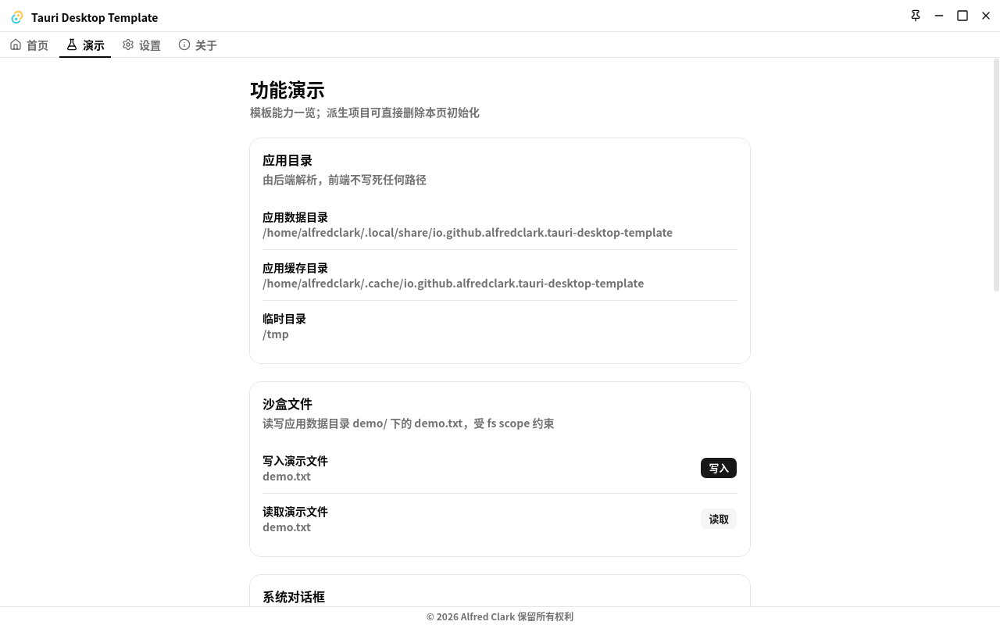
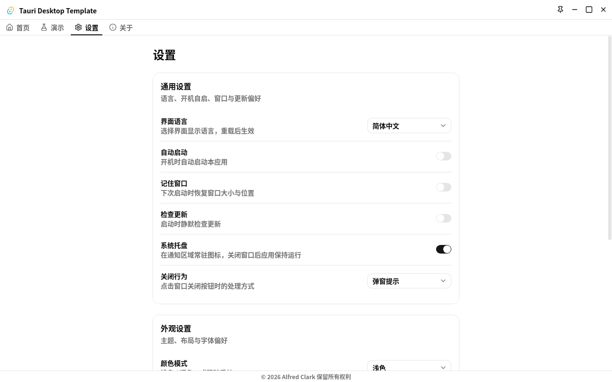
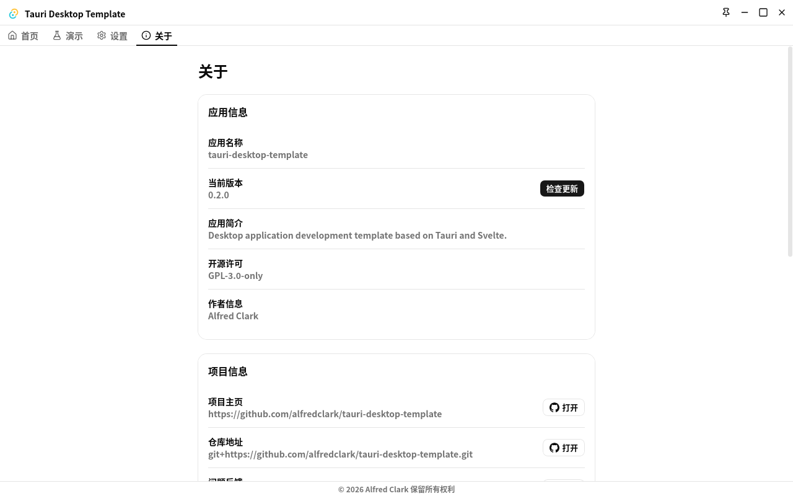

English | [简体中文](docs/README_zh-CN.md)

# tauri-desktop-template

Desktop application development template based on Tauri v2 + SvelteKit 2 + Svelte 5.

Production-ready starting point: type-safe Tauri commands, theming, frontend/backend i18n,
crash safety nets, and common desktop capabilities out of the box.

## Screenshots

| Home (`/`)                            | Demo (`/demo`)                  |
| ------------------------------------- | ------------------------------- |
|          |    |
| Settings (`/settings`)                | About (`/about`)                |
|  |  |

> Screenshots live in `docs/images/` and are named after their route (`home`, `demo`,
> `settings`, `about`).

## Features

1. **Type-safe command chain (tauri-specta)** — Rust `#[tauri::command]` +
   `#[specta::specta]` exports types into `src/libs/commands/bindings.ts` (generated, never
   hand-edited). Frontend calls go through the chained API in `src/libs/commands` only —
   no bare `invoke` in components:
   - Read value with fallback: `commands.greet(name).value("Default")`
   - Branch on status: `commands.greet(name).result()`
   - Transaction style: `commands.updateConfig({ locale }).success(onOk).failed(onFail)`
   - Unregistered `.failed()` failures are reported via `plugin-log` instead of being
     silently dropped.
2. **Dark/light mode + color themes** — `mode-watcher` follows the system (`light` / `dark` /
   `system`) with a Tailwind v4 `.dark` variant; five palettes (`neutral` / `blue` / `green` /
   `violet` / `rose`) switch via the `data-theme` attribute (`themes.css`). Pure frontend
   preference, persisted in `localStorage`, applied before first paint.
3. **Dual-track i18n (Paraglide + rust-i18n)** — frontend `paraglide-js` (`en` / `zh-CN`),
   backend `rust-i18n` (`src-tauri/locales/*.yml`, fallback `en`). The single source of truth
   is the backend `config.json` `locale` key: backend reads persisted value (or probes the OS
   locale via `tauri-plugin-os` on first run), frontend hydrates it in `+layout.ts` `load()`
   before first paint and aligns with `setLocale(locale, { reload: false })`.
4. **Crash safety nets, frontend + backend** — frontend `ErrorBoundary` (reports via
   `@tauri-apps/plugin-log`, stack trace in dev only, 2s throttle); backend panic hook in
   `cores/system.rs` (normal log first, `%TEMP%/my_app_crash.log` fallback with 512KB rotation).
5. **Desktop capability demo page (`/demo`)** — one card per plugin plus a file-drop card,
   deletable to bootstrap your own app (see “Remove the demo” below):
   - App directories (backend-resolved `appData` / `appCache` / `temp`)
   - Sandbox file (`$APPDATA/demo/*` scope + backend path-convergence check)
   - File drop (window drag-drop events; backend inspects metadata and imports into the sandbox)
   - Native dialogs (async-callback file / folder / save pickers, cancel returns `None`)
   - Plain-text clipboard (length-checked read/write)
   - Local notification (sent from backend)
   - Global shortcut (one fixed demo key, desktop only)
6. **Settings page (`/settings`)** — General group (language, autostart, remember window,
   auto-check updates, tray, close behavior with `prompt` / `exit` / `minimize_to_tray`) backed
   by `config.json` via `updateConfig`; Appearance group (theme, color theme, `tabs` / `sidebar`
   layout, system-font picker, weight, size) is frontend-only; one-click reset to defaults.
7. **About page (`/about`)** — app info, project links (`opener`, `http(s)` only), platform
   info, diagnostics (open log/config dirs, copy system info), and an updater panel
   (check → download with progress → restart; desktop only, 120s check timeout).
8. **Desktop shell** — frameless window with custom title bar (pin / minimize / maximize /
   close), system tray with localized menu (show/hide, quit), close-behavior interception,
   autostart, window-state restore (window starts `visible: false`, shown after restore),
   single-instance focus + deep-link arg forwarding (`tdt://` scheme), updater wired to GitHub
   Releases `latest.json`.

## Tech stack

> Version source of truth: `package.json` (frontend) and `src-tauri/Cargo.toml` (backend).
> Always code against the versions declared there.

| Layer           | Choice                                                                                                                                                                                                       | Notes                                                                                                       |
| --------------- | ------------------------------------------------------------------------------------------------------------------------------------------------------------------------------------------------------------ | ----------------------------------------------------------------------------------------------------------- |
| Frontend        | SvelteKit 2 + Svelte 5                                                                                                                                                                                       | SPA mode (`adapter-static` + `fallback: index.html`, `ssr = false`), Vite port 1420                         |
| UI              | shadcn-svelte (nova / neutral) + Tailwind CSS v4, Lucide icons, Geist font                                                                                                                                   | `cn()` class merge, `.dark` variant + `[data-theme]` palettes                                               |
| Bridge          | `@tauri-apps/api`, `plugin-log` / `opener` / `updater`, `system-fonts`                                                                                                                                       | Logs via `plugin-log`, font list via `system-fonts-api`                                                     |
| Contract        | tauri-specta + `specta` / `specta-typescript`                                                                                                                                                                | Generated `src/libs/commands/bindings.ts`, do not hand-edit                                                 |
| i18n            | Paraglide (frontend) + rust-i18n (backend)                                                                                                                                                                   | `src/libs/i18n/messages/*.json` + `src-tauri/locales/*.yml`                                                 |
| Backend         | Tauri v2 + Rust (edition 2024, pinned toolchain in `rust-toolchain.toml`)                                                                                                                                    | `commands/` thin wrappers, `features/` pure logic, `cores/` shared abilities                                |
| Backend plugins | `opener` / `store` / `log` / `os` / `updater` / `autostart` / `window-state` / `system-fonts` / `single-instance` / `deep-link` / `fs` / `dialog` / `clipboard-manager` / `notification` / `global-shortcut` | `updater` / `autostart` / `window-state` / `single-instance` / `deep-link` / `global-shortcut` desktop only |
| Quality         | TypeScript strict + `svelte-check`, ESLint + Prettier, vitest, pnpm                                                                                                                                          | Node `>= 24`, `pnpm-lock.yaml` + `Cargo.lock` committed                                                     |
| Release         | GitHub Actions (`ci.yml` / `release.yml`) + Tauri bundler                                                                                                                                                    | Version triplet kept in sync (see below)                                                                    |

## Quickstart

Prerequisites: Node `>= 24`, `pnpm@11.25.0`, Rust toolchain from `rust-toolchain.toml`.

```bash
pnpm install --frozen-lockfile   # install deps (never npm / yarn)

pnpm tauri:dev                   # full desktop dev: Vite (port 1420) + Tauri window
pnpm dev                         # frontend only (Tauri commands degrade gracefully)

pnpm format                      # fix both sides: Prettier + ESLint + cargo fmt
pnpm validate                    # test + lint + check (run after every change)

pnpm build                       # frontend only (adapter-static → build/)
pnpm tauri:build                 # full packaging; tauri:build:local compiles without bundling
```

Common scripts:

```bash
pnpm lint            # frontend + backend checks
pnpm check           # svelte-kit sync + svelte-check (strict TS)
pnpm test            # vitest + cargo test (single run)
pnpm test:cargo      # backend tests + regenerate bindings.ts
pnpm i18n:compile    # required after editing messages/
pnpm tauri:icon      # regenerate icons from static/icon.png
pnpm release         # bumpp linked versions: package.json + tauri.conf.json + Cargo.toml
```

## Pages

| Route       | Screenshot                 | Contents                                                                                           |
| ----------- | -------------------------- | -------------------------------------------------------------------------------------------------- |
| `/`         | `docs/images/home.png`     | Hero: stack icons + app name + intro. Layout-skeleton starting point, build your business here.    |
| `/demo`     | `docs/images/demo.png`     | Six plugin cards (paths / sandbox fs / dialogs / clipboard / notification / shortcut) + file drop. |
| `/settings` | `docs/images/settings.png` | General (backend-persisted) + Appearance (frontend-only) groups + reset button.                    |
| `/about`    | `docs/images/about.png`    | App / project / platform / diagnostics groups + updater panel.                                     |

Navigation tabs are registered once in `src/libs/navigation/nav-tabs.ts` and shared by the
`tabs` and `sidebar` layouts (`src/components/layout/`); add a page by adding one entry there.
Appearance (layout registry + font preference) lives in `src/libs/hooks/appearance.svelte.ts`.

## Configuration

Backend `config.json` (via `tauri-plugin-store`, `cores/config.rs`) holds the durable settings:

- `locale` (`"en" | "zh-CN"`, specta union — no bare `string`), `auto_start`,
  `remember_window`, `auto_check_update`, `tray_enabled`,
  `close_behavior` (`prompt` / `exit` / `minimize_to_tray`), `schema_version`.
- Write paths go through `update` / `save_locale` / `migrate` only; `update` runs an idempotent
  `migrate` inside. Adding/changing a field means updating `CURRENT_SCHEMA_VERSION` +
  `MIGRATIONS` when existing-field semantics change.
- Frontend-only appearance (theme, color theme, layout, font family/weight/size) stays in
  `localStorage` and never crosses the command bridge — an intentional exception.

## Workflows

**Add/change a command:** `features/<name>.rs` business logic (declare in `features/mod.rs`) →
`commands/<name>.rs` thin wrapper (`CommandResult` + both attributes + `collect_commands!`) →
`cargo test` regenerates `bindings.ts` → frontend chained-API call → joint debug. Never
hand-edit `bindings.ts`.

**Edit copy:** frontend `src/libs/i18n/messages/*.json` → `pnpm i18n:compile` → use `m.<key>()`
/ `setLocale()`; backend `src-tauri/locales/*.yml` → `rust_i18n::t!(...)`.

**Remove the demo** (bootstrap checklist, `greet` minimal contract stays): delete
`src/routes/(main)/demo/`, `src/components/widget/demo/`, `cores/demo.rs`,
`plugins/{fs,dialog,clipboard,notification,global_shortcut}.rs`; drop the `/demo` nav entry;
delete all `demo_`-prefixed message keys → `i18n:compile`; slim `features/demo.rs` and
`commands/demo.rs` (keep `greet`), sync `collect_commands!`; unregister plugins in
`plugins/mod.rs` + `lib.rs`, trim `capabilities/plugins.json`, drop the five plugin deps;
`cargo test` → `pnpm format` + `pnpm validate`. Full list: `AGENTS.md` §10.6.

## Project structure (condensed)

```text
src/routes/(main)/         # /, /demo, /settings, /about pages (+layout per group)
src/components/widget/    # settings/, about/, demo/ page widgets
src/components/layout/    # tabs / sidebar shells + title-bar / nav parts
src/libs/commands/        # bindings.ts (generated) + chained-API wrapper
src/libs/i18n/            # messages/ copy + project.inlang/ config
src/libs/navigation/      # nav-tabs.ts single-source nav registry
src-tauri/src/commands/   # thin wrappers + collect_commands!
src-tauri/src/features/   # pure business logic (no Tauri runtime)
src-tauri/src/cores/      # config / locale / system / tray / updater / ...
src-tauri/src/plugins/    # per-plugin init
```

See `AGENTS.md` for layering rules, security red lines, and the full structure.

## Validation & contributing

- After any change: `pnpm format`, then `pnpm validate` — both green before claiming “done”.
  Backend command changes additionally need `pnpm test:cargo` + a `bindings.ts` diff check;
  copy changes need `pnpm i18n:compile`.
- Commits follow Conventional Commits in lowercase English
  (e.g. `feat(i18n): persist locale in backend`), one concern per commit; never auto-commit.
- Release: PR → green CI → squash merge → `pnpm release` (linked triplet:
  `package.json` + `src-tauri/tauri.conf.json` + `src-tauri/Cargo.toml`) → tag `vX.Y.Z` →
  `release.yml` builds → `pnpm changelog`.

## License

GPL-3.0-only — see [LICENSE](LICENSE).
